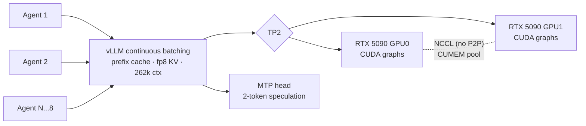

# ⚡ Ornith-1.5 NVFP4 on 2x RTX 5090 · vLLM TP2 + MTP + CUDA Graphs

[](https://github.com/vllm-project/vllm)
[](https://developer.nvidia.com/cuda-toolkit)
[](#)
[](https://huggingface.co/ornith-ai/Ornith-1.5-35B-A3B-NVFP4)
[](LICENSE)

**838 tokens/s aggregate across 8 concurrent agents, each with native 262k context, on two consumer GPUs.**

This is a complete, battle-tested recipe for serving a 35B MoE model with tensor parallelism,
multi-token-prediction speculative decoding, CUDA graphs, FP8 KV cache and prefix caching on
Blackwell (sm_120) hardware. Every step exists because the naive path failed and we found the fix.

## 📊 Results

| Concurrent agents | Aggregate throughput | Per agent |
|:---:|:---:|:---:|
| 1 | 110 tok/s | 110 tok/s |
| 2 | 221 tok/s | 112 tok/s |
| 4 | 409 tok/s | 108 tok/s |
| **8** | **838 tok/s** | **108 tok/s** |

Scaling is near linear: vLLM continuous batching keeps every agent at full speed.
With `--enable-prefix-caching` and a shared 16.5k-token document prefix, **TTFT stays under 2 s**
for 8 concurrent long-context requests.

Hardware: 2x RTX 5090 (32 GB), PCIe cross-NUMA, **no P2P** (`nvidia-smi topo -p2p r` reports unsupported).
Base image: `runpod/pytorch` Ubuntu 24.04, torch cu128.

## 🖥️ Single-GPU variant: 1x RTX PRO 6000 96GB (`scripts/serve_1gpu.sh`)

Measured 22 Aug 2026: the same model on **one** RTX PRO 6000 Blackwell (96 GB) with TP1
**beats the 2x 5090 TP2 pair** — no tensor parallelism means no NCCL walls at all, and the
fp8 KV pool grows to 5.43M tokens at 262k `--max-model-len`.

| Setup | 1 agent | 8 agents aggregate |
|---|:---:|:---:|
| 2x RTX 5090, TP2 | 110 tok/s | 838 tok/s |
| **1x RTX PRO 6000, TP1** | **181–192 tok/s** | **1001 tok/s** |

On the GRAPPA-grounded benchmark (8 agents, shared 16.5k-token paper, prefix cached):
prime prefill 0.91 s, cached TTFT 0.18–1.2 s, 53–64 tok/s per agent sustained under full
8x16.5k load. Note these grounded per-agent figures are **chunk-counted and therefore
conservative**: with MTP, vLLM packs multiple accepted tokens into one SSE chunk, so
chunk-based benches under-report by ~2.5x — measure from `usage.completion_tokens`
(see the companion [`qwen-uncensored-blackwell-vllm`](../qwen-uncensored-blackwell-vllm)
recipe, where the same corrected methodology gives its numbers).

`scripts/start_1gpu.sh` boots it after a pod restart. One flag difference that matters for
Qwen3.5-family checkpoints: `--tool-call-parser qwen3_xml` (with `hermes`, XML tool calls
leak into message content).

## 🧠 Architecture



## 🧱 The five Blackwell walls, and the fix for each

| # | Symptom | Root cause | Fix |
|---|---|---|---|
| 1 | `No supported CUDA architectures found for major versions [12]` | flashinfer JIT needs `nvcc >= 12.9` for sm_120; base image ships 12.8 | install CUDA 13.0 toolkit |
| 2 | `fatal error: curand_kernel.h: No such file` | `cuda-nvcc` alone lacks headers that flashinfer cutlass includes | full `cuda-toolkit-13-0`, not just the compiler |
| 3 | apt: `Conflicting values set for option Signed-By` | base image ships a second cuda .list clashing with cuda-keyring | remove both lists, write one signed-by entry |
| 4 | graph capture hangs forever: `No available shared memory broadcast block`, 0% GPU | NCCL allocator is not capture-safe on no-P2P TP | **`NCCL_CUMEM_ENABLE=1`** (the key line of this repo) |
| 5 | `ninja: exit status 127` after pod restart | container layer is ephemeral on RunPod; apt packages and kernel cache vanish | re-run `scripts/setup.sh` after every restart |

## 🚀 Quickstart

```bash
bash scripts/setup.sh     # apt fix + CUDA 13 toolkit + ninja + uv + vLLM + model download
bash scripts/serve.sh     # TP2 + MTP + graphs + fp8 KV + prefix caching, port 8000
python scripts/bench.py   # warm 1/2/4/8 agent throughput
```

The serve flags that matter:

```bash
NCCL_P2P_DISABLE=1 NCCL_CUMEM_ENABLE=1 VLLM_WORKER_MULTIPROC_METHOD=spawn \
vllm serve <model> \
  --tensor-parallel-size 2 --max-model-len 262144 --max-num-seqs 8 \
  --kv-cache-dtype fp8 --gpu-memory-utilization 0.92 \
  --speculative-config '{"method":"mtp","num_speculative_tokens":2}' \
  --enable-prefix-caching --max-num-batched-tokens 8192 \
  --enable-auto-tool-choice --tool-call-parser hermes \
  --reasoning-parser qwen3 --trust-remote-code
```

## ⚠️ Operational gotchas

- **Never `pkill -9` the server.** With CUMEM enabled, SIGKILL leaks ~30 GB of VRAM per GPU with
  zero owning processes; only a pod restart clears it. Use `pkill -TERM -f "vllm serve"; sleep 20`.
- **The first request is warmup.** flashinfer autotune contaminates it; always benchmark warm.
- **Benchmark on the box.** Token rates measured through an SSH tunnel measure the tunnel.
- **Shared long prompts need prefix caching.** Without it, N agents re-prefill the same document
  N times and chunked prefill starves decode (speculative decoding caps the per-step token budget).
  One priming request caches the shared prefix; TTFT drops below 2 s.
- **Agent frameworks send `tools`.** Without `--enable-auto-tool-choice --tool-call-parser hermes`
  vLLM answers HTTP 400 to any client that includes a toolset.

## 🎬 Demo: 8 grounded agents on one guideline

`demo/record_swarm.py` renders 8 concurrent agents streaming into a live 4x2 dashboard
(per-panel tok/s and TTFT) and writes frames for a video.

To keep display content factual, each agent is grounded on the full text of an open-access
clinical guideline (fetched from Europe PMC) with the instruction: *use ONLY the source;
where the source is silent, write "not detailed in source"*. Grounding turned a
hallucination-prone recall task into verifiable extraction.

## 📄 License

MIT
